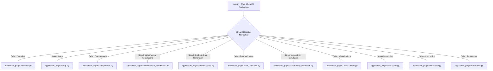
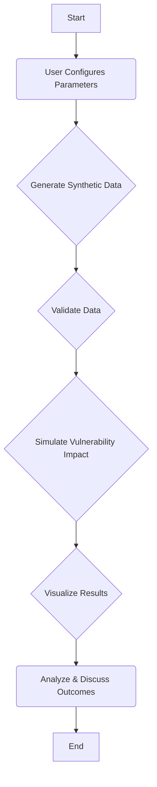

id: 690bb8d5adbb0296a6bfb062_documentation
summary: AI Security Vulnerability Simulation Lab Documentation
feedback link: https://docs.google.com/forms/d/e/1FAIpQLSfWkOK-in_bMMoHSZfcIvAeO58PAH9wrDqcxnJABHaxiDqhSA/viewform?usp=sf_link
environments: Web
status: Published
# AI Security Vulnerability Simulation Lab: A Comprehensive Codelab

## 1. Introduction and Application Overview
Duration: 0:05:00

Welcome to the **AI Security Vulnerability Simulation Lab** codelab! This guide will walk you through a Streamlit application designed to provide hands-on experience in understanding, identifying, and analyzing AI-security vulnerabilities within agentic AI systems. Specifically, it focuses on systems used for industrial safety monitoring.

### Importance of the Application
In today's rapidly evolving technological landscape, AI systems are increasingly deployed in critical domains like industrial safety. Ensuring the security and reliability of these systems is paramount. This lab addresses this need by offering a simulated environment where developers and security professionals can:
*   **Identify common AI-security vulnerabilities:** Explore threats like 'synthetic-identity risk' (compromised agents acting maliciously) and 'untraceable data leakage' (covert data exfiltration).
*   **Learn adversarial testing techniques:** Understand how prompt injection and data poisoning attacks can manipulate AI behavior.
*   **Analyze defense strategies:** Evaluate the effectiveness of various risk controls in mitigating AI security threats.

This hands-on approach helps bridge the gap between theoretical knowledge and practical application, fostering a deeper understanding of AI security challenges and solutions.

### Learning Outcomes
Upon completing this codelab, you will be able to:
*   Understand the core components and flow of the AI Security Vulnerability Simulation Lab.
*   Identify and categorize different AI-security vulnerabilities.
*   Grasp the mathematical foundations used to quantify attack impacts.
*   Implement and analyze simulated attacks and their effects on system metrics.
*   Interpret visualizations that highlight the consequences of AI vulnerabilities.
*   Discuss the implications of these findings for building resilient AI systems.

### Scope and Constraints
This lab is designed for efficiency and accessibility:
*   It runs end-to-end on a mid-spec laptop (8 GB RAM) in under 5 minutes for the simulation parts.
*   It exclusively uses open-source Python libraries from PyPI.
*   All major steps include detailed code comments and brief narrative explanations of 'what' is happening and 'why'.

### Application Architecture
The application is structured as a multi-page Streamlit application, where `app.py` acts as the orchestrator, dynamically loading different modules from the `application_pages` directory based on user navigation. This modular design enhances maintainability and readability.



<aside class="positive">
<b>Key Takeaway:</b> The modular design with Streamlit's multi-page capabilities allows for a clear separation of concerns, making the application easy to navigate and understand.
</aside>

## 2. Setting Up the Environment and Library Imports
Duration: 0:02:00

Before diving into the simulation, it's essential to ensure all necessary Python libraries are installed and imported. This step (`application_pages/setup.py`) prepares the environment by making all required functionalities for data generation, manipulation, simulation, and visualization available.

### Code Overview (`application_pages/setup.py`)
This page is primarily informative within the Streamlit application, confirming that the setup steps (which would typically involve `pip install` commands in a real-world scenario) are conceptually complete.

```python
import streamlit as st

# Setup Page

def main():
    st.markdown("""
    ## Section 2: Setup and Library Imports
    First, we import all necessary Python libraries. This ensures that all required functionalities for data generation, manipulation, simulation, and visualization are available.
    The required libraries have been successfully loaded. We are now ready to define the parameters for our simulation and proceed with data generation and analysis.
    """)
```

### Required Libraries
While not explicitly coded in `setup.py`, the application implicitly relies on several fundamental Python libraries. These would typically be listed in a `requirements.txt` file.

```console
# Example requirements.txt
streamlit
pandas
numpy
matplotlib
```

To install these, you would typically run:
```bash
pip install -r requirements.txt
```

<aside class="positive">
<b>Best Practice:</b> Always manage your project dependencies using a `requirements.txt` file or similar package manager configuration to ensure reproducibility.
</aside>

## 3. Defining Configuration Parameters
Duration: 0:03:00

This section (`application_pages/configuration.py`) is crucial for interactive exploration. It allows users to define the parameters that control the characteristics of the synthetic data and the nature of the simulated attack. These parameters directly influence the simulation's outcomes, allowing you to experiment with different scenarios.

### Key Simulation Parameters
*   **Attack Intensity ($$A_{intensity}$$):** This parameter controls the severity of the attack, ranging from $0.0$ (no attack) to $1.0$ (maximum intensity). A higher value indicates a more potent or widespread attack.
*   **Attack Type:** This determines the specific type of vulnerability being simulated (e.g., Prompt Injection, Data Poisoning). Different attack types have distinct impacts on system metrics.
*   **Number of Compromised Agents ($$N_{agents}$$):** This specifies how many of the simulated AI agents are affected by the attack.

The Streamlit application maintains these parameters in `st.session_state`, ensuring they persist across different pages of the application.

### Code Overview (`application_pages/configuration.py`)
This page displays the currently selected simulation parameters. In a fully interactive version, these values would be set via Streamlit widgets like sliders and select boxes, then stored in `st.session_state`.

```python
import streamlit as st

# Configuration Page

def main():
    st.markdown("""
    ## Section 3: Define Configuration Parameters (User Interaction)
    
    This section allows users to interactively set the parameters for the AI security vulnerability simulation. These parameters control the characteristics of the synthetic data and the nature of the simulated attack. Inline help text is provided for each control.

    **Key parameters are:**
    - **Attack Intensity ($$A_{intensity}$$):** Controls the severity of the attack, ranging from $$0.0$$ (no attack) to $$1.0$$ (maximum intensity).
    - **Attack Type:** Determines the specific type of vulnerability being simulated (e.g., Prompt Injection, Data Poisoning).
    - **Number of Compromised Agents ($$N_{agents}$$): Specifies how many of the simulated agents are affected by the attack.
    """)

    st.write("")
    st.markdown("### Current Simulation Parameters")
    # These values would typically be updated via Streamlit widgets and stored in st.session_state
    # For this codelab, we assume they are already set or have default values.
    st.write(f"**Selected Attack Intensity:** {st.session_state.selected_attack_intensity}")
    st.write(f"**Selected Attack Type:** {st.session_state.selected_attack_type}")
    st.write(f"**Selected Number of Compromised Agents:** {st.session_state.selected_num_compromised_agents}")
    st.write(f"**Simulation Duration (Hours):** 2")
    st.write(f"**Number of Agents:** 10")
    st.write(f"**Base Alert Rate (Per Hour):** 5")
    st.write(f"**Anomaly Rate Multiplier:** 2.5")
    st.write(f"**Random Seed:** 42")
    st.write("")
```

<aside class="negative">
<b>Important:</b> The code snippet above assumes `st.session_state` variables like `selected_attack_intensity` are already initialized. In a complete Streamlit app, you would add logic to set default values or user inputs on the `app.py` or a dedicated configuration page before these values are displayed.
</aside>

## 4. Mathematical Foundations of Attack Simulation
Duration: 0:04:00

To provide a concrete and quantifiable simulation, this section (`application_pages/mathematical_foundations.py`) defines the mathematical models that govern how different AI security vulnerabilities impact key system metrics. These equations ensure that the simulated effects are consistent, measurable, and directly tied to the chosen attack parameters.

### Core Simulation Flowchart
The mathematical models are applied during the "Simulate Vulnerability Impact" phase of the overall simulation process.



### Key Mathematical Relationships
#### Alert Frequency Over Time
The alert frequency under attack, $$F_{alerts\_attacked}(t)$$, is modeled as an increase over the baseline frequency, $$F_{alerts\_base}(t)$$, proportional to the attack intensity and a type-specific coefficient:

$$F_{alerts\_attacked}(t) = F_{alerts\_base}(t) \cdot (1 + A_{intensity} \cdot C_{type})$$

Where:
*   $$A_{intensity}$$ is the user-defined attack intensity, $$A_{intensity} \in [0, 1]$$.
*   $$C_{type}$$ is a scaling factor specific to the `Attack Type`, reflecting its inherent impact potential (e.g., a data poisoning attack might have a higher $$C_{type}$$ than a mild prompt injection).

#### Detection Latency
The simulated detection latency, $$L_{detection}$$, represents the delay between an attack incident and its detection. It increases with attack intensity:

$$L_{detection} = L_{base} + A_{intensity} \cdot D_{type}$$

Where:
*   $$L_{base}$$ is a nominal baseline detection latency.
*   $$D_{type}$$ is a coefficient related to the `Attack Type`, representing how challenging that specific attack is to detect quickly.

#### Agent Integrity Score
The integrity score for a compromised agent, $$I_{agent\_attacked}$$, is reduced from its baseline, $$I_{agent\_base}$$, based on attack intensity and type:

$$I_{agent\_attacked} = I_{agent\_base} \cdot (1 - A_{intensity} \cdot K_{type})$$

Where:
*   $$K_{type}$$ is a coefficient for the `Attack Type`, reflecting its detrimental effect on agent trustworthiness or operational integrity. For uncompromised agents, $$I_{agent\_attacked} = I_{agent\_base}$$.

### Code Overview (`application_pages/mathematical_foundations.py`)
This page explains the formulas using Streamlit's markdown with LaTeX support.

```python
import streamlit as st

# Mathematical Foundations Page

def main():
    st.markdown(r"""
    ## Section 4: Mathematical Foundations of Attack Simulation
    
    To simulate the impact of AI security vulnerabilities concretely, we define mathematical relationships that govern how attacks influence key system metrics. These relationships ensure a quantifiable and consistent effect based on the chosen attack parameters.

    #### Alert Frequency Over Time
    The alert frequency under attack, $$F_{alerts\_attacked}(t)$$, is modeled as an increase over the baseline frequency, $$F_{alerts\_base}(t)$$, proportional to the attack intensity and a type-specific coefficient:
    $$F_{alerts\_attacked}(t) = F_{alerts\_base}(t) \cdot (1 + A_{intensity} \cdot C_{type})$$
    Where:
    - $$A_{intensity}$$ is the user-defined attack intensity, $$A_{intensity} \in [0, 1]$$.
    - $$C_{type}$$ is a scaling factor specific to the `Attack Type`, reflecting its inherent impact potential (e.g., a data poisoning attack might have a higher $$C_{type}$$ than a mild prompt injection).

    #### Detection Latency
    The simulated detection latency, $$L_{detection}$$, represents the delay between an attack incident and its detection. It increases with attack intensity:
    $$L_{detection} = L_{base} + A_{intensity} \cdot D_{type}$$
    Where:
    - $$L_{base}$$ is a nominal baseline detection latency.
    - $$D_{type}$$ is a coefficient related to the `Attack Type`, representing how challenging that specific attack is to detect quickly.

    #### Agent Integrity Score
    The integrity score for a compromised agent, $$I_{agent\_attacked}$$, is reduced from its baseline, $$I_{agent\_base}$$, based on attack intensity and type:
    $$I_{agent\_attacked} = I_{agent\_base} \cdot (1 - A_{intensity} \cdot K_{type})$$
    Where:
    - $$K_{type}$$ is a coefficient for the `Attack Type`, reflecting its detrimental effect on agent trustworthiness or operational integrity. For uncompromised agents, $$I_{agent\_attacked} = I_{agent\_base}$$.

    These formulae provide a structured way to quantify the effects of 'synthetic-identity risk' and 'data poisoning' on system metrics, making the simulation robust and interpretable.
    """)
```

<aside class="positive">
<b>Concept Explained:</b> These mathematical models allow for a rigorous, quantitative analysis of AI security vulnerabilities, moving beyond qualitative descriptions to provide measurable impacts. This is crucial for evaluating risk and the effectiveness of countermeasures.
</aside>

## 5. Synthetic Data Generation
Duration: 0:05:00

To create a controlled and reproducible environment for studying AI security, the lab generates a synthetic dataset (`application_pages/synthetic_data.py`). This dataset mimics sensor readings from industrial equipment, communication logs from AI agents, and baseline security metrics. It includes realistic numeric, categorical, and time-series data, sufficient for demonstrating the lab's concepts without relying on external data sources.

The use of synthetic data ensures:
*   **Privacy:** No real-world sensitive data is involved.
*   **Reproducibility:** The same data can be generated consistently using a fixed random seed.
*   **Scalability:** Data size and complexity can be controlled for efficient execution on various hardware.

### Code Overview (`application_pages/synthetic_data.py`)
This section contains a placeholder for the `generate_synthetic_safety_data` function. In a complete implementation, this function would create Pandas DataFrames representing different aspects of the industrial safety system (e.g., sensor data, agent logs, security metrics).

```python
import streamlit as st
import pandas as pd
import numpy as np

# Synthetic Data Generation Page

def main():
    st.markdown("""
    ## Section 5: Synthetic Data Generation - Core Function Implementation
    
    To provide a controlled environment for studying AI security, we first generate a synthetic dataset. This dataset simulates sensor readings from industrial equipment, communication logs from AI agents, and baseline security metrics. It includes realistic numeric, categorical, and time-series data, sufficient for demonstrating the lab's concepts without needing external data. A lightweight sample is ensured for quick execution.
    """)
    
    # Synthetic Data Generation Function
    def generate_synthetic_safety_data(num_agents, simulation_duration_hours, base_alert_rate, anomaly_rate_multiplier, random_seed):
        # your implementation
        
        # Placeholder for actual data generation
        # In a real scenario, this would generate data using numpy and pandas
        # Example for sensor_data:
        time_stamps = pd.to_datetime(pd.date_range(start="2023-01-01", periods=simulation_duration_hours*60, freq="min"))
        sensor_data = pd.DataFrame({
            'timestamp': time_stamps,
            'equipment_id': np.random.randint(1, num_agents + 1, size=len(time_stamps)),
            'temperature': np.random.normal(70, 5, len(time_stamps)),
            'pressure': np.random.normal(100, 10, len(time_stamps)),
            'vibration': np.random.normal(5, 1, len(time_stamps))
        })
        
        # Example for agent_logs:
        agent_logs = pd.DataFrame({
            'timestamp': time_stamps[::10], # Less frequent logs
            'agent_id': np.random.randint(1, num_agents + 1, size=len(time_stamps)//10),
            'log_message': [f"Agent {aid} processed data." for aid in np.random.randint(1, num_agents + 1, size=len(time_stamps)//10)],
            'status': np.random.choice(['INFO', 'WARNING'], size=len(time_stamps)//10)
        })

        # Example for security_metrics:
        security_metrics = pd.DataFrame({
            'timestamp': time_stamps,
            'alert_rate': np.random.poisson(base_alert_rate, size=len(time_stamps)),
            'agent_integrity_score': np.random.uniform(0.8, 1.0, size=len(time_stamps)),
            'detection_latency': np.random.uniform(0.5, 2.0, size=len(time_stamps))
        })
        
        # Placeholder for configuration dictionary
        simulation_config = {
            "num_agents": num_agents,
            "simulation_duration_hours": simulation_duration_hours,
            "base_alert_rate": base_alert_rate,
            "anomaly_rate_multiplier": anomaly_rate_multiplier,
            "random_seed": random_seed
        }

        return sensor_data, agent_logs, security_metrics, simulation_config
    
    # Display Head of DataFrames - Placeholder
    st.subheader("Synthetic Data (Baseline)")
    
    # Calling the placeholder function with example parameters
    # In a real app, these would come from st.session_state
    num_agents = 10
    simulation_duration_hours = 2
    base_alert_rate = 5
    anomaly_rate_multiplier = 2.5
    random_seed = 42
    
    # Initialize session state if not already done (for demonstration)
    if 'sensor_data_base' not in st.session_state:
        st.session_state.sensor_data_base, \
        st.session_state.agent_logs_base, \
        st.session_state.security_metrics_base, \
        st.session_state.simulation_config = generate_synthetic_safety_data(
            num_agents, simulation_duration_hours, base_alert_rate, anomaly_rate_multiplier, random_seed
        )

    st.write(" Sensor Data (Baseline) ")
    st.dataframe(st.session_state.sensor_data_base.head())
    st.write(" Agent Logs (Baseline) ")
    st.dataframe(st.session_state.agent_logs_base.head())
    st.write(" Security Metrics (Baseline) ")
    st.dataframe(st.session_state.security_metrics_base.head())
    
    st.markdown("""
    The synthetic dataset has been successfully generated. We now have a baseline representation of an industrial safety monitoring system, including sensor data, agent communications, and unattacked security metrics. This synthetic data simulates the operational environment before any security vulnerabilities are introduced.
    """)
```

<aside class="positive">
<b>Development Tip:</b> When building simulations, using synthetic data with controlled parameters (like random seeds) is invaluable for debugging, testing, and ensuring consistent results across runs.
</aside>

## 6. Data Validation and Initial Statistics
Duration: 0:03:00

Data validation (`application_pages/data_validation.py`) is a critical step after data generation. It ensures the integrity and quality of our synthetic dataset before any simulation logic is applied. This process typically involves checking for:
*   **Expected column names:** Ensuring schemas match expectations.
*   **Correct data types:** Confirming numerical, categorical, and datetime fields are correctly interpreted.
*   **Primary-key uniqueness:** Guaranteeing unique identifiers where expected.
*   **Absence of missing values:** Verifying that critical fields do not contain nulls.

Additionally, summary statistics for numeric columns provide an initial understanding of the data distribution, which helps in identifying any anomalies even before attack simulation.

### Code Overview (`application_pages/data_validation.py`)
This page contains a placeholder for the `validate_and_summarize_data` function. In a complete implementation, this function would perform various checks using Pandas functionalities.

```python
import streamlit as st
import pandas as pd
import numpy as np

# Data Validation Page

def main():
    st.markdown("""
    ## Section 6: Data Validation and Initial Statistics
    
    Data validation is a crucial step to ensure the integrity and quality of our synthetic dataset. This process confirms expected column names, data types, and primary-key uniqueness, and asserts the absence of missing values in critical fields. Summary statistics for numeric columns provide an initial understanding of the data distribution.
    """)
    
    # Data Validation Function - Placeholder
    def validate_and_summarize_data(df: pd.DataFrame, df_name: str, expected_columns: list, expected_dtypes: dict, critical_fields_no_null: list, unique_key: str = None):
        st.subheader(f"Validation for {df_name}")
        
        # 1. Check for expected columns
        missing_cols = [col for col in expected_columns if col not in df.columns]
        if missing_cols:
            st.error(f"Missing columns in {df_name}: {', '.join(missing_cols)}")
            return False
        else:
            st.success(f"All expected columns found in {df_name}.")

        # 2. Check data types
        dtype_errors = []
        for col, dtype in expected_dtypes.items():
            if col in df.columns and str(df[col].dtype) != dtype:
                dtype_errors.append(f"Column '{col}' has type '{df[col].dtype}', expected '{dtype}'.")
        if dtype_errors:
            for error in dtype_errors:
                st.warning(error)
            st.warning(f"Data type mismatches found in {df_name}.")
            # return False # Decide if dtype mismatch is critical enough to stop
        else:
            st.success(f"All expected data types are correct in {df_name}.")

        # 3. Check for missing values in critical fields
        null_errors = []
        for field in critical_fields_no_null:
            if field in df.columns and df[field].isnull().any():
                null_errors.append(f"Critical field '{field}' contains missing values.")
        if null_errors:
            for error in null_errors:
                st.error(error)
            st.error(f"Missing values found in critical fields of {df_name}.")
            return False
        else:
            st.success(f"No missing values in critical fields of {df_name}.")

        # 4. Check for unique key (if provided)
        if unique_key and unique_key in df.columns:
            if not df[unique_key].is_unique:
                st.error(f"Unique key '{unique_key}' is not unique in {df_name}.")
                return False
            else:
                st.success(f"Unique key '{unique_key}' is unique in {df_name}.")
        
        # 5. Display summary statistics for numeric columns
        st.markdown(f"#### Summary Statistics for {df_name}")
        st.dataframe(df.describe())

        return True

    # Assuming st.session_state.sensor_data_base, etc., are populated from the previous step
    if 'sensor_data_base' in st.session_state:
        st.write("")
        # Define expected schema for demonstration
        sensor_data_cols = ['timestamp', 'equipment_id', 'temperature', 'pressure', 'vibration']
        sensor_data_dtypes = {'timestamp': 'datetime64[ns]', 'equipment_id': 'int64', 'temperature': 'float64', 'pressure': 'float64', 'vibration': 'float64'}
        sensor_data_critical = ['timestamp', 'equipment_id']
        validate_and_summarize_data(st.session_state.sensor_data_base, "Sensor Data", sensor_data_cols, sensor_data_dtypes, sensor_data_critical, 'timestamp')

        st.write("")
        agent_logs_cols = ['timestamp', 'agent_id', 'log_message', 'status']
        agent_logs_dtypes = {'timestamp': 'datetime64[ns]', 'agent_id': 'int64', 'log_message': 'object', 'status': 'object'}
        agent_logs_critical = ['timestamp', 'agent_id', 'log_message']
        validate_and_summarize_data(st.session_state.agent_logs_base, "Agent Logs", agent_logs_cols, agent_logs_dtypes, agent_logs_critical, 'timestamp')
        
        st.write("")
        security_metrics_cols = ['timestamp', 'alert_rate', 'agent_integrity_score', 'detection_latency']
        security_metrics_dtypes = {'timestamp': 'datetime64[ns]', 'alert_rate': 'int64', 'agent_integrity_score': 'float64', 'detection_latency': 'float64'}
        security_metrics_critical = ['timestamp']
        validate_and_summarize_data(st.session_state.security_metrics_base, "Security Metrics", security_metrics_cols, security_metrics_dtypes, security_metrics_critical, 'timestamp')
        
        st.success("All baseline datasets passed validation checks.")
    else:
        st.warning("Please run the 'Synthetic Data Generation' step first to populate baseline data.")

    st.markdown("""
    The synthetic datasets have passed validation checks, confirming their structural integrity and data types. The summary statistics provide a preliminary understanding of the distributions within the data, which forms a reliable foundation for simulating attacks.
    """)
```

<aside class="positive">
<b>Concept Explained:</b> Robust data validation is a cornerstone of reliable simulations and machine learning pipelines. It prevents "garbage in, garbage out" scenarios, ensuring that subsequent analyses and models are built upon trustworthy data.
</aside>

## 7. Vulnerability Simulation - Attack Logic Implementation
Duration: 0:05:00

This is the core of the lab where the AI security vulnerabilities are simulated. The `simulate_vulnerability_impact` function (`application_pages/vulnerability_simulation.py`) takes the baseline security metrics and applies the mathematical models defined in Section 4. This modification is based on the user-selected `Attack Type`, `Attack Intensity`, and `Number of Compromised Agents`.

This simulation concretely demonstrates the effects of:
*   **'Synthetic-identity risk':** Compromised agents acting maliciously, leading to altered behaviors or outputs.
*   **'Untraceable data leakage':** Covert data exfiltration via altered agent behavior or system metrics.

### Code Overview (`application_pages/vulnerability_simulation.py`)
This section provides a placeholder for the `simulate_vulnerability_impact` function, demonstrating how it would modify the baseline `security_metrics_df`. The function calculates `attacked_metrics_df` and `attack_events_df`.

```python
import streamlit as st
import pandas as pd
import numpy as np

# Vulnerability Simulation Page

def main():
    st.markdown("""
    ## Section 7: Vulnerability Simulation - Attack Logic Implementation
    
    This section details the core logic for simulating AI security vulnerabilities. The `simulate_vulnerability_impact` function applies the mathematical models defined earlier to modify the baseline security metrics based on the user-selected `Attack Type`, `Attack Intensity`, and `Number of Compromised Agents`. This simulation will demonstrate the effects of 'synthetic-identity risk' (compromised agents acting maliciously) and 'untraceable data leakage' (covert data exfiltration via altered behavior).
    """)
    
    # Simulate Vulnerability Impact Function - Placeholder
    def simulate_vulnerability_impact(base_metrics_df: pd.DataFrame, attack_type: str, attack_intensity: float, num_compromised_agents: int, simulation_config: dict):
        attacked_metrics_df = base_metrics_df.copy()
        
        # Define coefficients based on attack type (from Mathematical Foundations)
        # These are illustrative coefficients; actual values would be tuned.
        type_coefficients = {
            "Prompt Injection": {"C_type": 0.5, "D_type": 1.5, "K_type": 0.3},
            "Data Poisoning": {"C_type": 0.8, "D_type": 2.5, "K_type": 0.6},
            # Add other attack types here
        }
        
        C_type = type_coefficients.get(attack_type, {}).get("C_type", 0.0)
        D_type = type_coefficients.get(attack_type, {}).get("D_type", 0.0)
        K_type = type_coefficients.get(attack_type, {}).get("K_type", 0.0)

        # Apply Alert Frequency Over Time formula
        # F_alerts_attacked(t) = F_alerts_base(t) * (1 + A_intensity * C_type)
        attacked_metrics_df['alert_rate_attacked'] = attacked_metrics_df['alert_rate'] * (1 + attack_intensity * C_type)
        
        # Apply Detection Latency formula
        # L_detection = L_base + A_intensity * D_type
        base_latency = simulation_config.get("base_latency", 0.5) # Example base latency
        attacked_metrics_df['detection_latency_attacked'] = attacked_metrics_df['detection_latency'] + (attack_intensity * D_type)

        # Apply Agent Integrity Score formula for *compromised agents*
        # I_agent_attacked = I_agent_base * (1 - A_intensity * K_type)
        # Assuming we have an agent_id in base_metrics_df or a way to link to agents
        # For simplicity, we'll apply a general reduction here, or simulate specific agents.
        # In a more complex simulation, you'd apply this to specific num_compromised_agents' scores
        # Here, we'll simulate a general reduction based on the idea that the system's overall integrity is affected.
        attacked_metrics_df['agent_integrity_score_attacked'] = attacked_metrics_df['agent_integrity_score'] * (1 - attack_intensity * K_type)
        
        # Simulate attack events (for untraceable data leakage, etc.)
        # These events would occur when the attack_intensity > 0
        if attack_intensity > 0:
            num_attack_events = int(attack_intensity * len(base_metrics_df) * 0.1) # 10% of data points might have an event
            if num_attack_events > 0:
                event_indices = np.random.choice(base_metrics_df.index, num_attack_events, replace=False)
                attack_events_df = pd.DataFrame({
                    'timestamp': base_metrics_df.loc[event_indices, 'timestamp'],
                    'event_type': [attack_type] * num_attack_events,
                    'severity': [f"High ({attack_intensity:.2f})" if attack_intensity > 0.5 else f"Medium ({attack_intensity:.2f})"] * num_attack_events,
                    'description': [f"Simulated {attack_type} detected with intensity {attack_intensity:.2f}. " \
                                    f"Compromised agents: {num_compromised_agents}." for _ in range(num_attack_events)]
                }).sort_values('timestamp').reset_index(drop=True)
            else:
                attack_events_df = pd.DataFrame(columns=['timestamp', 'event_type', 'severity', 'description'])
        else:
            attack_events_df = pd.DataFrame(columns=['timestamp', 'event_type', 'severity', 'description'])
            
        return attacked_metrics_df, attack_events_df

    # Display Attacked Results - Placeholder
    st.subheader("Simulated Attack Results")
    
    # Retrieve base data and configuration from session_state
    if 'security_metrics_base' in st.session_state and \
       'selected_attack_type' in st.session_state and \
       'selected_attack_intensity' in st.session_state and \
       'selected_num_compromised_agents' in st.session_state and \
       'simulation_config' in st.session_state:

        attacked_metrics, attack_events = simulate_vulnerability_impact(
            st.session_state.security_metrics_base,
            st.session_state.selected_attack_type,
            st.session_state.selected_attack_intensity,
            st.session_state.selected_num_compromised_agents,
            st.session_state.simulation_config
        )
        
        # Store attacked results in session state for later use (e.g., visualizations)
        st.session_state.security_metrics_attacked = attacked_metrics
        st.session_state.attack_events = attack_events

        st.write(" Attacked Security Metrics ")
        st.dataframe(attacked_metrics.head())
        st.write(" Attack Events ")
        st.dataframe(attack_events.head())
    else:
        st.warning("Please ensure 'Configuration' and 'Synthetic Data Generation' steps are completed.")
        st.dataframe(pd.DataFrame()) # Empty dataframe placeholder
        st.dataframe(pd.DataFrame()) # Empty dataframe placeholder
    
    st.markdown("""
    The simulation of the chosen AI security vulnerability has been applied to the baseline security metrics. We now have a modified dataset that reflects the impact of the attack on alert frequency, agent integrity, and provides details on simulated detection latency. This data will be used for visualization and further analysis.
    """)
```

<aside class="positive">
<b>Key Insight:</b> This step demonstrates how abstract mathematical models translate into tangible changes in system performance metrics, making the impact of AI vulnerabilities quantifiable and observable.
</aside>

## 8. Visualizing Attack Trends
Duration: 0:04:00

Visualizations are essential for interpreting the results of the simulation. This section (`application_pages/visualizations.py`) focuses on creating a trend plot to compare `Alert Frequency over Time` for both the baseline (unattacked) and the attacked scenarios.

This line plot provides a clear visual representation of how the simulated vulnerability impacts the system's ability to generate alerts. This directly reflects concepts like:
*   **Prompt injection hijacking LLM behavior:** Leading to an abnormal increase or decrease in alerts.
*   **Data poisoning causing malicious samples:** Altering outputs and subsequently, alert frequencies.

### Code Overview (`application_pages/visualizations.py`)
This section provides a placeholder for the `plot_alert_frequency_trend` function. It uses `matplotlib.pyplot` to generate a line plot comparing baseline and attacked alert frequencies.

```python
import streamlit as st
import matplotlib.pyplot as plt
import pandas as pd

# Visualizations Page

def main():
    st.markdown("""
    ## Section 8: Trend Plot: Alert Frequency Over Time - Implementation
    
    A trend plot is essential for visualizing time-based metrics. This line plot will compare the `Alert Frequency over Time` for both the baseline (unattacked) and the attacked scenarios. It provides a clear visual representation of how the simulated vulnerability impacts the system's ability to generate alerts, reflecting the concept of prompt injection 'hijacking LLM behavior' or data poisoning causing 'malicious samples' to alter outputs.
    """)
    
    # Plot Alert Frequency Trend Function - Placeholder
    def plot_alert_frequency_trend(base_df: pd.DataFrame, attacked_df: pd.DataFrame, attack_type: str, attack_intensity: float, font_size: int = 12):
        fig, ax = plt.subplots(figsize=(12, 6))
        
        ax.plot(base_df['timestamp'], base_df['alert_rate'], label='Baseline Alert Frequency', color='blue', alpha=0.7)
        ax.plot(attacked_df['timestamp'], attacked_df['alert_rate_attacked'], label=f'Attacked Alert Frequency ({attack_type} @ {attack_intensity*100:.0f}%)', color='red', linestyle='--', alpha=0.7)
        
        ax.set_title(f'Alert Frequency Over Time: {attack_type} Simulation', fontsize=font_size + 2)
        ax.set_xlabel('Timestamp', fontsize=font_size)
        ax.set_ylabel('Alert Frequency', fontsize=font_size)
        ax.legend(fontsize=font_size - 2)
        ax.grid(True, linestyle=':', alpha=0.6)
        plt.xticks(rotation=45, ha='right', fontsize=font_size - 2)
        plt.yticks(fontsize=font_size - 2)
        plt.tight_layout()
        
        return fig

    # Display Plot - Placeholder
    if 'security_metrics_base' in st.session_state and 'security_metrics_attacked' in st.session_state and \
       'selected_attack_type' in st.session_state and 'selected_attack_intensity' in st.session_state:
        
        fig_alert_frequency = plot_alert_frequency_trend(
            st.session_state.security_metrics_base,
            st.session_state.security_metrics_attacked,
            st.session_state.selected_attack_type,
            st.session_state.selected_attack_intensity
        )
        st.pyplot(fig_alert_frequency)
    else:
        st.warning("Please complete 'Synthetic Data Generation' and 'Vulnerability Simulation' steps to see the plot.")
        st.pyplot(plt.figure()) # Display an empty figure
```

<aside class="positive">
<b>Visualization Importance:</b> Visualizing time-series data is critical for understanding trends and anomalies that might not be obvious from raw data tables. This plot makes the impact of the simulated attack immediately apparent.
</aside>

## 9. Discussion of Results and Learning Outcomes
Duration: 0:03:00

Having progressed through the simulation, this section (`application_pages/discussion.py`) consolidates the observations and reiterates the key learning outcomes. It prompts reflection on how different attack parameters manifest in system behavior and how this understanding contributes to building more robust AI systems.

### What We've Learned
Through this simulation, we have observed the tangible impacts of various AI security vulnerabilities on an agentic industrial safety monitoring system. The lab provided a hands-on experience in:

*   **Identifying Vulnerabilities**: We saw how 'synthetic-identity risk' and 'untraceable data leakage' manifest through changes in system alerts and agent integrity.
*   **Adversarial Testing**: The simulation of 'prompt injection' and 'data poisoning' illustrated how malicious inputs can significantly alter system behavior and outputs, mirroring how such attacks can 'hijack LLM behavior'.
*   **Analyzing Defenses**: By manipulating `Attack Intensity` and `Attack Type`, users can infer the necessity of robust 'risk controls in the assurance plan' and 'red teaming chains of agents' for continuous validation.
*   **Understanding System Response**: The plots revealed how an attack can increase alert frequency and potentially lengthen detection latency, emphasizing the need for adaptive systems to implement effective defenses.

### Code Overview (`application_pages/discussion.py`)

```python
import streamlit as st

# Discussion of Results Page

def main():
    st.markdown("""
    ## Section 11: Discussion of Results and Learning Outcomes
    
    Through this simulation, we have observed the tangible impacts of various AI security vulnerabilities on an agentic industrial safety monitoring system. The lab provided a hands-on experience in:

    - **Identifying Vulnerabilities**: We saw how 'synthetic-identity risk' and 'untraceable data leakage' manifest through changes in system alerts and agent integrity.
    - **Adversarial Testing**: The simulation of 'prompt injection' and 'data poisoning' illustrated how malicious inputs can significantly alter system behavior and outputs, mirroring how such attacks can 'hijack LLM behavior'.
    - **Analyzing Defenses**: By manipulating `Attack Intensity` and `Attack Type`, users can infer the necessity of robust 'risk controls in the assurance plan' and 'red teaming chains of agents' for continuous validation.
    - **Understanding System Response**: The plots revealed how an attack can increase alert frequency and potentially lengthen detection latency, emphasizing the need for adaptive systems to implement effective defenses.

    This practical exposure reinforces the theoretical concepts of AI security and the importance of rigorous testing and validation in building trustworthy AI systems.
    """)
```

<aside class="positive">
<b>Further Exploration:</b> Consider how different combinations of attack types and intensities might interact. How would varying the number of compromised agents change the observed impact?
</aside>

## 10. Conclusion
Duration: 0:01:00

This final content section (`application_pages/conclusion.py`) summarizes the overall value proposition of the AI Security Vulnerability Simulation Lab. It reiterates the importance of practical exposure to AI security threats and the role of interactive tools in fostering deeper understanding and promoting the development of resilient AI systems.

### Code Overview (`application_pages/conclusion.py`)
```python
import streamlit as st

# Conclusion Page

def main():
    st.markdown("""
    ## Section 12: Conclusion
    
    This AI Security Vulnerability Simulation Lab successfully demonstrated the critical need for understanding and mitigating threats in agentic AI systems. By generating synthetic data and simulating various attack scenarios, users gained valuable insights into the practical implications of AI security vulnerabilities. The interactive nature of the lab allows for continuous exploration of different attack parameters, fostering a deeper comprehension of how to design and validate resilient AI systems.
    """)
```

## 11. References
Duration: 0:01:00

This section (`application_pages/references.py`) provides a list of resources that informed the development of this lab and offers further reading for those interested in delving deeper into AI security, adversarial testing, and relevant Python libraries.

### Code Overview (`application_pages/references.py`)
```python
import streamlit as st

# References Page

def main():
    st.markdown("""
    ## Section 13: References
    1. **[1] Case 3: Agentic AI for Safety Monitoring, Provided Resource Document.** This document describes AI-security vulnerabilities like 'synthetic-identity risk' and 'untraceable data leakage', and the importance of rigorous testing and risk controls.
    2. **[2] Unit 6: Testing, Validation and AI Security, Adversarial Testing and Red-Teaming, Provided Resource Document.** This section explores threats like prompt injection and data poisoning, and discusses the impact of malicious samples on LLM output.
    3. **Pandas Library**: A fast, powerful, flexible and easy to use open source data analysis and manipulation tool, built on top of the Python programming language. (https://pandas.pydata.org/)
    4. **NumPy Library**: The fundamental package for scientific computing with Python. (https://numpy.org/)
    5. **Matplotlib Library**: A comprehensive library for creating static, animated, and interactive visualizations in Python. (https://matplotlib.org/)
    6. **Seaborn Library**: A Python data visualization library based on matplotlib. It provides a high-level interface for drawing attractive and informative statistical graphics. (https://seaborn.pydata.org/)
    7. **IPywidgets Library**: Interactive HTML widgets for Jupyter notebooks and the IPython kernel. (https://ipywidgets.readthedocs.io/en/latest/)
    """)
```
